<h1>CPE405-HW1-61024304 TempHumidBox</h1>

ตัวกล่อง

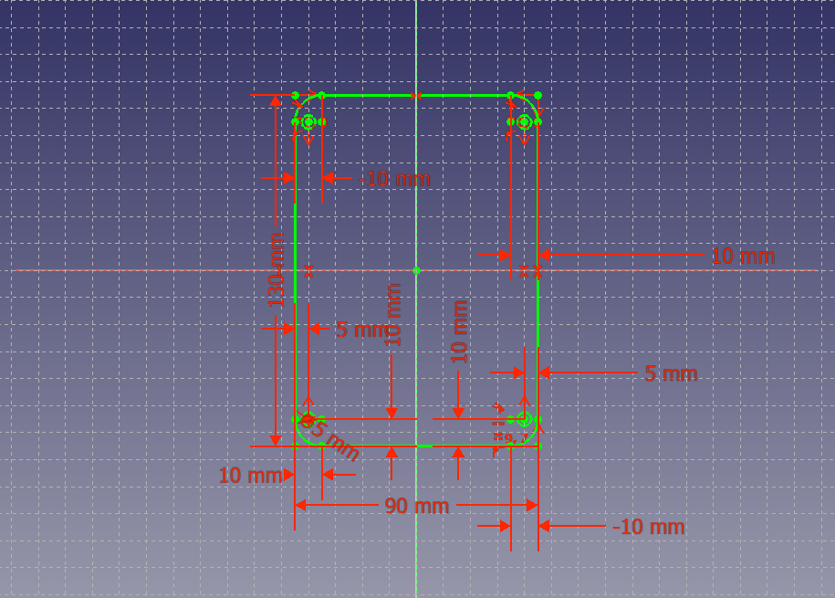

ฐานและรูน็อตยึดกำแพงจะตั้งไว้ที่ 90mm(ในกล่องกว้าง70mm)x 130mm ฐานหนา5mm กำแพงหนา 5 mm สูง30mm รูน็อตด้านนอก 5 mm 

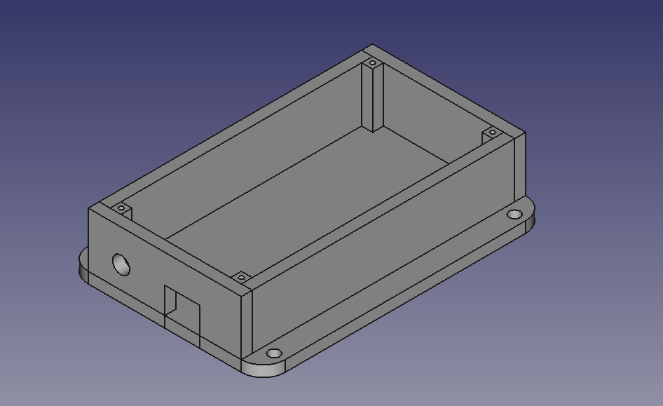

รูน็อตด้านในขนาด 2 mm ห่างจากขอบกล่อง2.5 mm ทั้ง2ด้าน

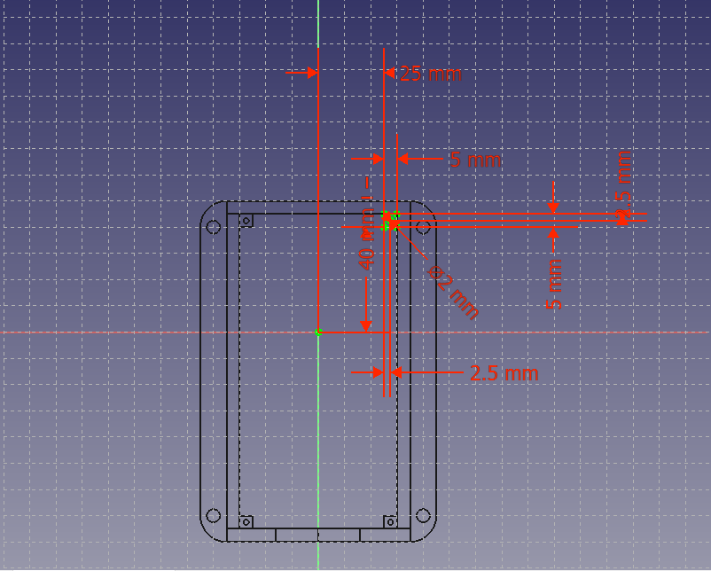

รู DC และ Relay 

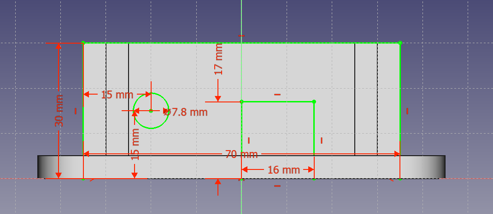
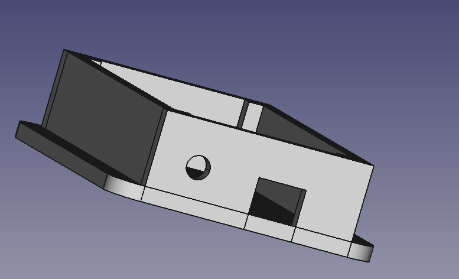

ฝาด่านบน จะมีพื้นที่ 70mm x 130mm กำแพงสูง 15mm 

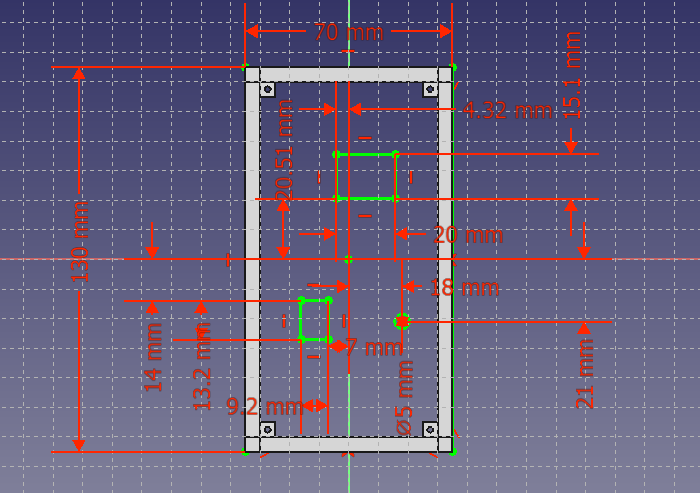
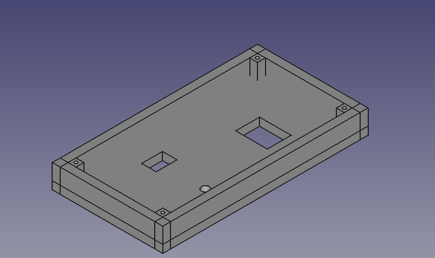

รู น็อตด้านใน ขนาด 2 mm ห่างขอบ 2.5 mm 

อ้างอิงขนาดอุปกรณ์

DC

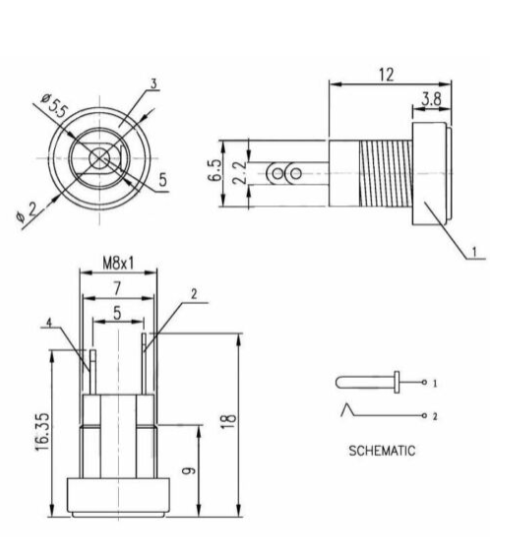

DHT22

led

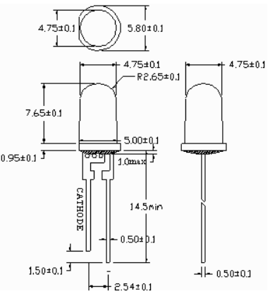

node32

protoboard

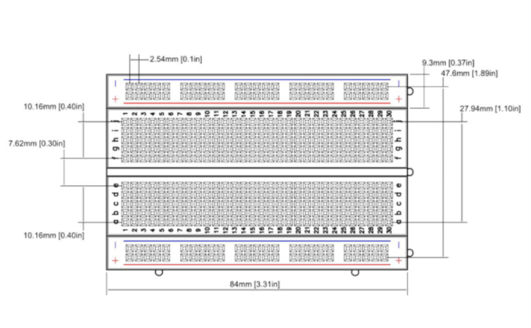

relay

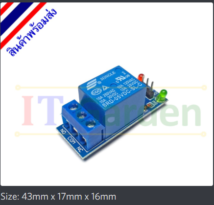

switch

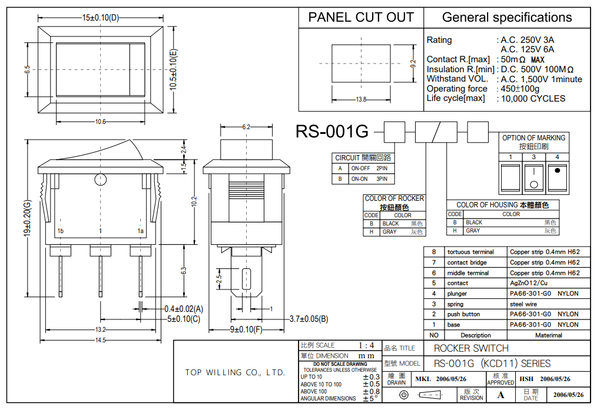

