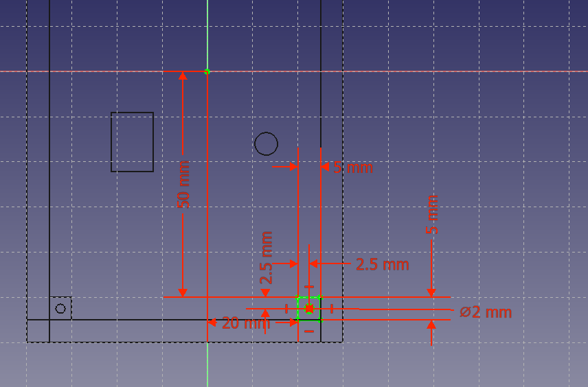

<h1>CPE405-HW1-61024304 TempHumidBoxx</h1>

ตัวกล่อง

ฐานและรูน็อตยึดกำแพง จะตั้งไว้ที่ 90mm(ในกล่องกว้าง70mm) x 130mm ขอบกำแพงหน้า 5 mm รูน็อตขนาด 5 mm 

รูน็อตด้านในขนาด 2 mm ห่างจากขอบกล่อง2.5 mm ทั้ง2ด้าน

รู DC และ Relay 

ฝาด่านบน จะมีพื้นที่ 70mm x 130mm กำแพงสูง 15mm 

รู น็อตด้านใน ขนาด 2 mm ห่างขอบ 2.5 mm 

